<div align="center">

# 🌿 EcoQuest
### AI-Powered Gamified Carbon Tracker & Action Platform for Pune

[](http://localhost:8000)
[](http://localhost:8000)
[](http://localhost:8000)
[](docs/implementation.md)

<br/>

**Measure · Understand · Personalize · Play · Verify · Reward · Compete · Reduce**

<p align="center">
  EcoQuest transforms everyday sustainable actions across Pune into an engaging, gamified adventure.<br/>
  Powered by an <strong>Adaptive AI Personalization, Computer Vision Verification & EcoGuard Anti-Cheat Engine</strong>.
</p>

</div>

---

<br/>

## 🎬 Video Demonstration Walkthrough

<div align="center">

<video src="https://github.com/Ann-Artist/EcoQuest/raw/main/docs/assets/EcoQuest.mp4" controls="controls" width="100%" style="max-width: 880px; border-radius: 14px; box-shadow: 0 12px 36px rgba(0,0,0,0.6);">
  <source src="docs/assets/EcoQuest.mp4" type="video/mp4">
  Your browser does not support direct video playback. <a href="docs/assets/EcoQuest.mp4">Download and watch EcoQuest.mp4</a>
</video>

<br/>

<p align="center">
  <sub>🎥 Video file located at: <a href="docs/assets/EcoQuest.mp4"><code>docs/assets/EcoQuest.mp4</code></a> (Citizen & Admin workflows)</sub>
</p>

</div>

<br/>

---

<br/>

## 📸 Complete Website Visual Tour

<br/>

### 🌟 1. Public Portal & Onboarding

<br/>

#### 🔹 Landing & Hero Experience
*Modern dark-mode landing interface with zero-friction entry and direct registration Call-to-Action:*

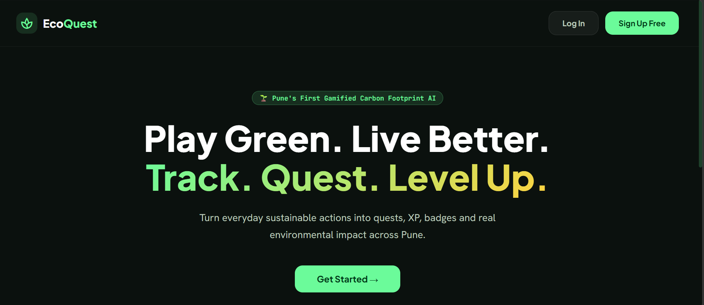

<br/>
<br/>

---

<br/>

#### 🔹 New Citizen Registration
*Streamlined account creation initializing user level to Level 1 (0 XP Eco Seedling):*

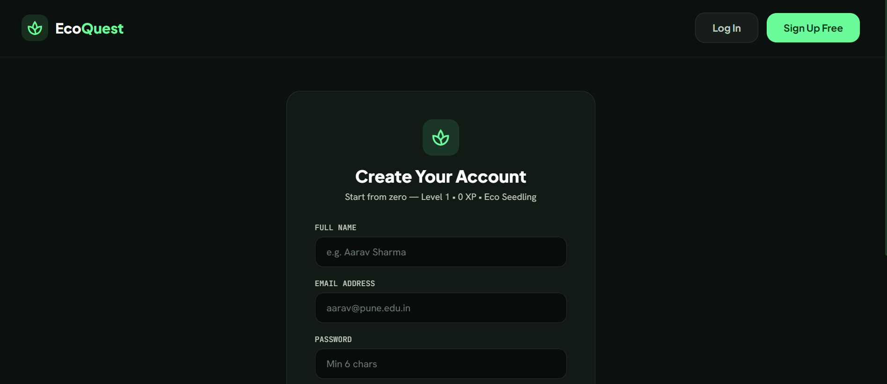

<br/>
<br/>

---

<br/>

### 📊 2. Citizen Experience & AI Gamification Engine

<br/>

#### 🔹 Citizen Dashboard & AI Emission Hotspot Analysis
*Real-time carbon footprint baseline, AI Hotspot Analyzer isolating primary emission drivers, Green Persona badge, and action streak counters:*

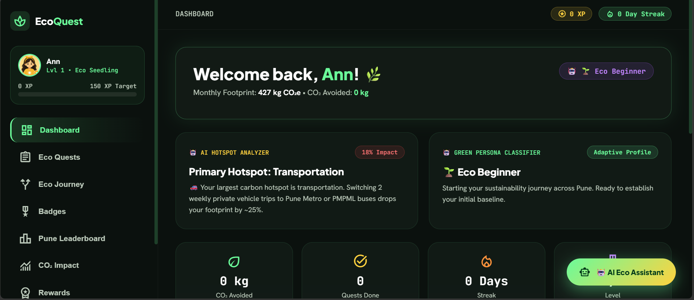

<br/>
<br/>

---

<br/>

#### 🔹 Personalized Eco Quests Catalog
*Tailored quest recommendations with difficulty tiers, verification badges, and "Can't Do This" AI quest swap buttons:*

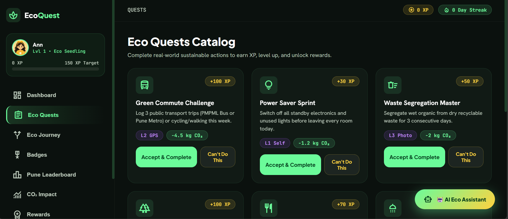

<br/>
<br/>

---

<br/>

#### 🔹 Eco Journey 6-Tier Progression Tree
*Visual progression pathway detailing unlocked and upcoming environmental rank titles from Eco Seedling to Planet Champion:*

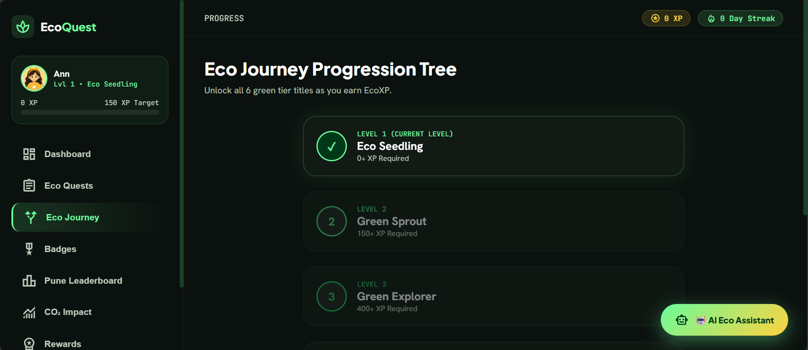

<br/>
<br/>

---

<br/>

#### 🔹 Achievement Badges Collection
*Milestone badges earned through quest completion counts, category actions, and consecutive daily streaks:*

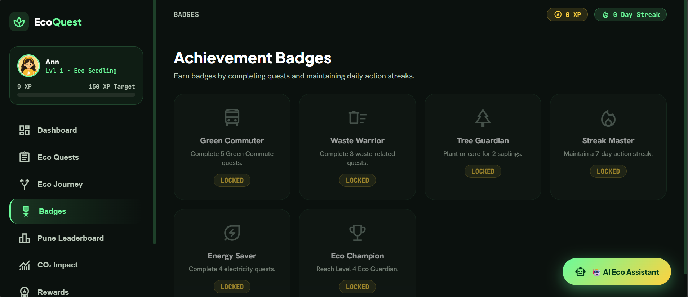

<br/>
<br/>

---

<br/>

#### 🔹 Pune Real-Time Ward Leaderboard
*Live rankings of all registered Pune citizens and municipal administrators synchronized directly with the database:*

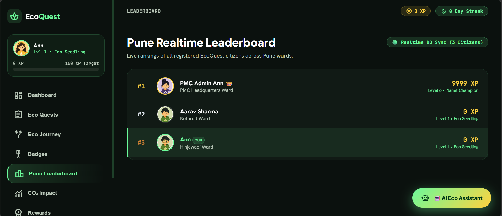

<br/>
<br/>

---

<br/>

#### 🔹 CO₂ Impact Dashboard & Category Emission Breakdown
*Detailed category-by-category metrics displaying monthly carbon savings and net emissions:*

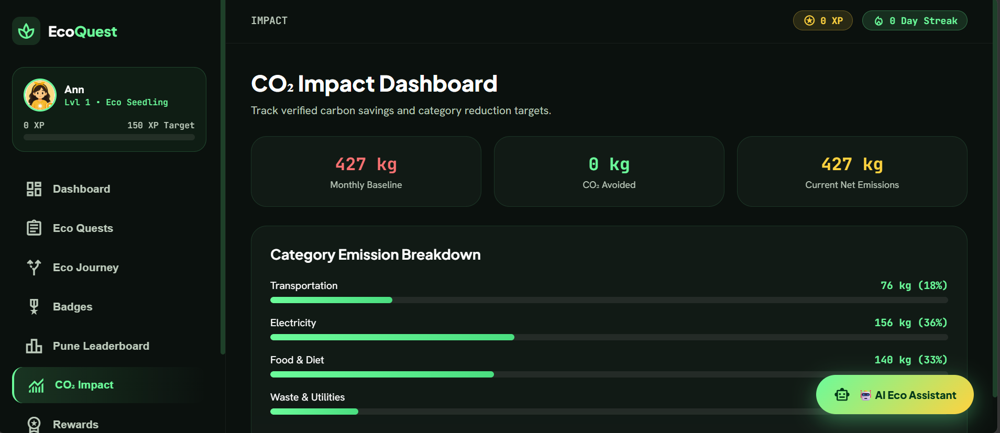

<br/>
<br/>

---

<br/>

#### 🔹 PMC Municipal & Transit Reward Campaigns
*Redeem earned EcoXP for exclusive Pune Municipal Corporation (PMC) certificates, urban sapling kits, and MahaMetro discounts:*

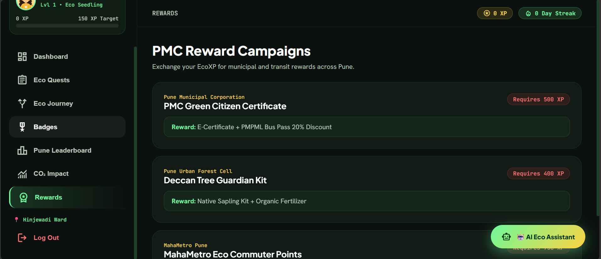

<br/>
<br/>

---

<br/>

#### 🔹 Profile Settings & Official Character Avatar Selector
*Select from official high-resolution avatars and update personal lifestyle baseline parameters:*

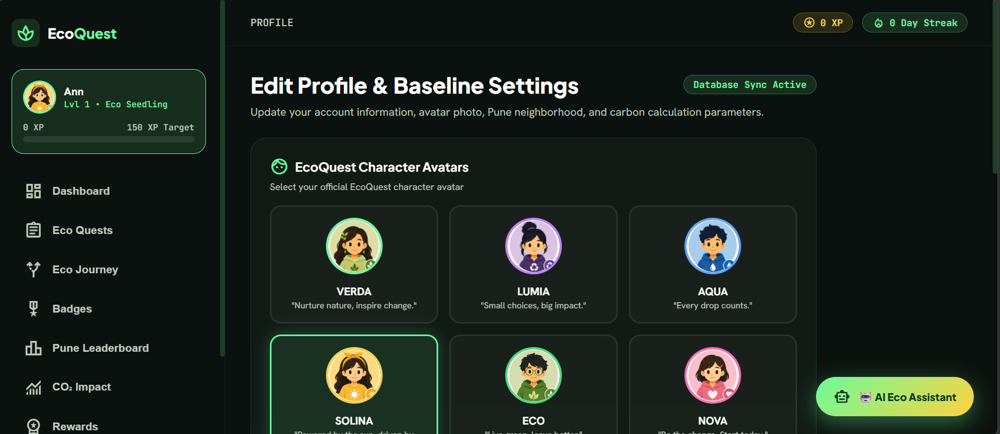

<br/>
<br/>

---

<br/>

### 👑 3. PMC Municipal Administrative Console

<br/>

#### 🔹 PMC Admin Control Center Dashboard
*Central municipal command console displaying registered citizens count, active quests, system health, and EcoGuard anti-cheat integrity:*

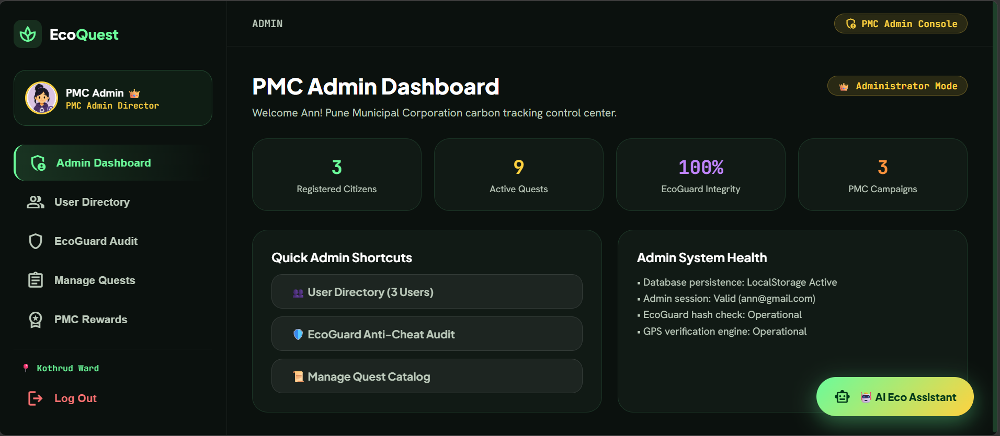

<br/>
<br/>

---

<br/>

#### 🔹 Real-Time Database User Directory
*Complete registry of all citizen and administrator accounts across Pune wards:*

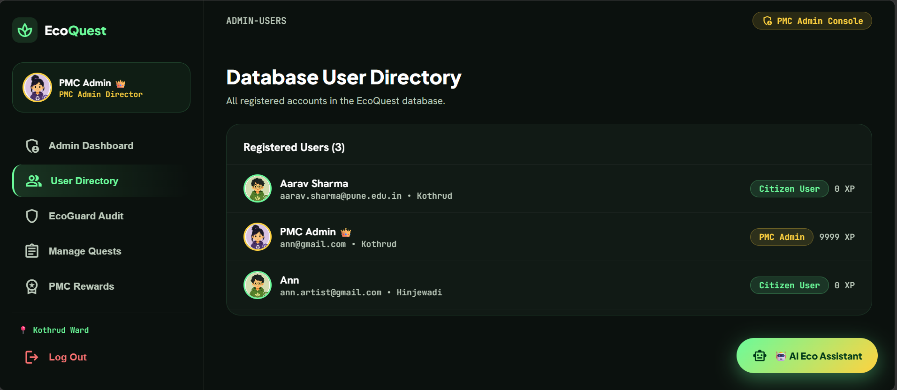

<br/>
<br/>

---

<br/>

#### 🔹 EcoGuard AI Anti-Cheat Console
*Automated verification rules including velocity checks, duplicate photo SHA-256 hash detection, and Pune corridor GPS geofencing:*

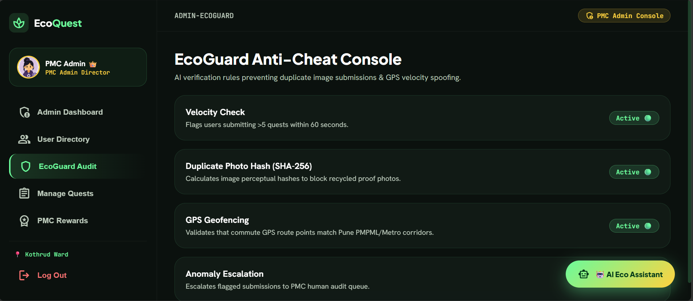

<br/>
<br/>

---

<br/>

#### 🔹 Municipal Quest Catalog Management
*Create and configure active municipal quests, XP reward amounts, and CO₂ impact metrics:*

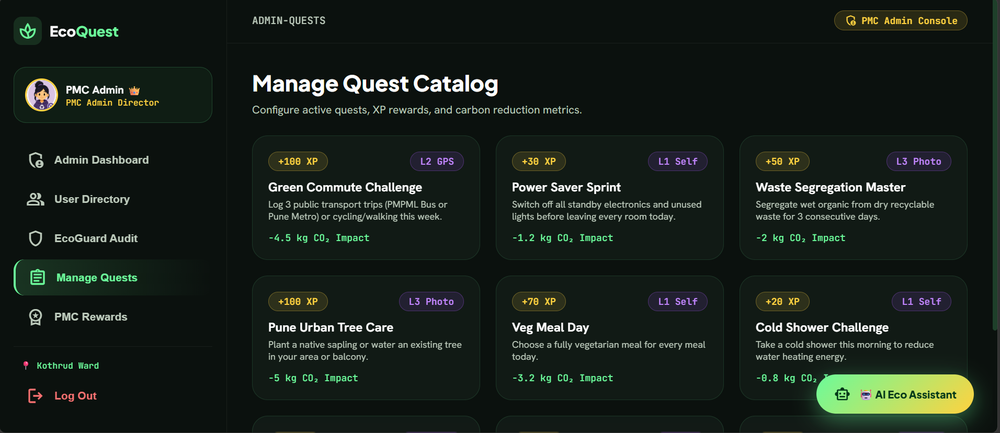

<br/>
<br/>

---

<br/>

## 🔁 The Core AI Feedback Loop

```text
                    USER LIFESTYLE SURVEY
                              ↓
                      DETERMINISTIC CARBON ENGINE
                              ↓
                   Monthly Baseline (e.g. 182 kg CO₂e)
                              ↓
                   ┌───────────────────────┐
                   │       AI ENGINE       │
                   └───────────┬───────────┘
                               ↓
        ┌──────────────────────┼──────────────────────┐
        ↓                      ↓                      ↓
  AI Hotspot Analyzer  Green Persona Classifier  AI Recommendations
  (Identifies top      (Classifies behavior      (Tailors quest pool
  emission category)    profile: VERDA, ECO...)   to user hotspots)
        │                      │                      │
        └──────────────────────┼──────────────────────┘
                               ↓
                     Personalized Quest Pool
                               ↓
                       "Can't Do This"
                   (AI Quest Adaptation Swap)
                               ↓
                      Proof Verification
                   (AI Vision Object Check)
                               ↓
                 EcoXP Awarded & Level Up
                               ↓
                   AI Weekly Progress Report
                               ↓
                       New User Behavior
                               ↓
                       Re-Personalization 🔄
```

<br/>

---

<br/>

## 🤖 Integrated AI Engine Components

EcoQuest features an 8-component AI architecture designed for real-time personalization, verification, and natural language assistance:

| AI Component | Function | Module Location |
|---|---|---|
| 🚗 **AI Hotspot Analyzer** | Analyzes monthly category footprint breakdown to isolate top emissions | `lib/carbon/hotspot.ts` |
| 🎭 **Green Persona Classifier** | Classifies users into adaptive behavior profiles independently from game level | `lib/ai/persona.ts` |
| 🎯 **AI Recommendation Engine** | Generates tailored action recommendations based on user profile payloads | `lib/ai/recommendations.ts` |
| 🔄 **AI "Can't Do This" Quest Swap** | Replaces rejected quests with 2 lower-friction personalized eco alternatives | `lib/ai/recommendations.ts` |
| 👁️ **AI Photo Vision Verification** | Simulates computer vision object detection, confidence scoring, & proof analysis | `lib/ai/vision.ts` |
| 🛡️ **AI Anti-Cheat (EcoGuard)** | Detects velocity check anomalies, duplicate SHA-256 image hashes, & GPS geofencing | `lib/verification/ecoGuard.ts` |
| 📊 **AI Weekly Sustainability Report** | Synthesizes weekly progress, XP, streak, & CO₂ avoided into natural language summaries | `lib/ai/weeklyReport.ts` |
| 💬 **Interactive Eco AI Chat Assistant** | Floating AI assistant answering queries on Pune Metro/PMPML routes, waste rules, & recipes | `lib/ai/llm.ts` |

<br/>

---

<br/>

## 🌟 Official Character Avatars

EcoQuest includes 6 official high-resolution character avatars:

| Character | Tagline | Focus Area | Asset Path |
|---|---|---|---|
| 🌿 **VERDA** | *"Nurture nature, inspire change."* | Urban Tree Care & Greenery | `avatars/verda.png` |
| 💜 **LUMIA** | *"Small choices, big impact."* | Waste Segregation & Circularity | `avatars/lumia.png` |
| 💧 **AQUA** | *"Every drop counts."* | Water Heating & Energy Conservation | `avatars/aqua.png` |
| ☀️ **SOLINA** | *"Powered by the sun, driven by hope."* | Renewable Energy & Solar Tech | `avatars/solina.png` |
| 👓 **ECO** | *"Live green, leave better."* | Balanced Eco Lifestyle & Audits | `avatars/eco.png` |
| 💖 **NOVA** | *"Be the change. Start today."* | Zero Plastic & Community Action | `avatars/nova.png` |

<br/>

---

<br/>

## 🎮 Gamification & Level Progression

Citizens progress through a 6-tier progression system:

```text
Level 1: Eco Seedling  (0 XP)       🌱
Level 2: Green Sprout  (150 XP)     🌿
Level 3: Eco Explorer  (400 XP)     🍀
Level 4: Eco Guardian  (800 XP)     🛡️
Level 5: Eco Warrior   (1400 XP)    ⚔️
Level 6: Planet Champion (2200 XP)  👑
```

### Verification Tiers
- **Level 1 — Self-Reported**: Low-risk household actions (e.g. switching off standby devices).
- **Level 2 — Smart Verification**: Medium-risk actions with location/GPS route verification.
- **Level 3 — Proof Required**: High-value actions requiring geotagged photo proof analyzed by the AI Vision Engine.

<br/>

---

<br/>

## 🔑 Login & Role Credentials

EcoQuest supports role-based authentication with pre-seeded accounts:

### 🔒 PMC Admin Login
- **Email**: `ann@gmail.com`
- **Password**: `Ann@2026`
- **Features**: Direct access to Admin Overview (`/admin`), User Directory (`/admin-users`), EcoGuard Audit Console (`/admin-ecoguard`), and Quest Catalog Manager (`/admin-quests`).

### 🌱 Citizen User Login
- **Email**: `aarav.sharma@pune.edu.in`
- **Password**: `aarav2026`
- **Features**: Direct access to Citizen Dashboard (`/dashboard`), Personalized Quests, Badges, Pune Ward Leaderboard, CO₂ Impact, and PMC Rewards.

<br/>

---

<br/>

## 📁 Repository Structure

```text
EcoQuest/
├── avatars/                      # High-resolution character avatar PNGs (verda, lumia, aqua, solina, eco, nova)
│   ├── verda.png
│   ├── lumia.png
│   ├── aqua.png
│   ├── solina.png
│   ├── eco.png
│   └── nova.png
├── docs/                         # Documentation, Video & Media Assets
│   ├── implementation.md         # 100% Completion Audit & Implementation Plan
│   └── assets/                   # Video demo, screenshots & system flow diagrams
│       ├── EcoQuest.mp4          # Complete application video walkthrough (31 MB)
│       ├── 01_landing_hero.png
│       ├── 02_create_account.png
│       ├── 03_citizen_dashboard.png
│       ├── 04_eco_quests_catalog.png
│       ├── 05_eco_journey_progression.png
│       ├── 06_achievement_badges.png
│       ├── 07_pune_realtime_leaderboard.png
│       ├── 08_co2_impact_breakdown.png
│       ├── 09_pmc_reward_campaigns.png
│       ├── 10_profile_avatar_settings.png
│       ├── 11_admin_dashboard.png
│       ├── 12_admin_user_directory.png
│       ├── 13_admin_ecoguard_audit.png
│       └── 14_admin_manage_quests.png
├── lib/                          # Backend & AI Engine Modules
│   ├── ai/                       # AI Hotspot, Persona, Vision, Recommendations, Report, & Chat
│   ├── carbon/                   # Carbon calculator & emission factor engine
│   ├── verification/             # EcoGuard Anti-Cheat & CV simulation
│   └── gamification/             # XP, level tiers, & leaderboard logic
├── app/                          # Next.js Application Route Pages
├── components/                   # Reusable UI Components
├── data/                         # Quest, badge, reward, & emission datasets
├── index.html                    # 100% Self-contained Single-Page Application
├── server.ps1                    # Local PowerShell HTTP Web Server
└── README.md                     # Project Overview, Video & Visual Showcase
```

<br/>

---

<br/>

## 🚀 How to Run Locally

### Option 1: Local HTTP Web Server (Recommended)
Run the included PowerShell server script from the project root:

```powershell
powershell -ExecutionPolicy Bypass -File server.ps1
```
Then open your browser and navigate to: **`http://localhost:8000`**

### Option 2: Direct File Launch
Simply double-click or open `index.html` directly in any modern web browser!

<br/>

---

<br/>

## ☁️ Deployment Options

EcoQuest includes configuration for free, 1-click deployment across multiple platforms:

| Platform | Deployment Method | Notes |
|---|---|---|
| **GitHub Pages** | Settings ➔ Pages ➔ Deploy from `main` | Zero-config (`404.html` + `.nojekyll` included) |
| **Netlify** | Import `Ann-Artist/EcoQuest` | Clean SPA rewrites via `_redirects` |
| **Render** | Create Static Site from GitHub repo | Automatic global CDN |
| **Vercel** | Import `Ann-Artist/EcoQuest` | Native single-page routing via `vercel.json` |

<br/>

---

<div align="center">

**EcoQuest — Play Green. Live Better.** 🌍

</div>
