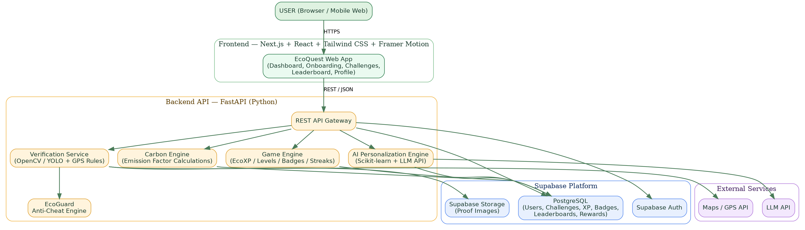
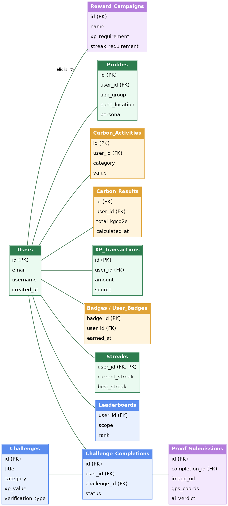
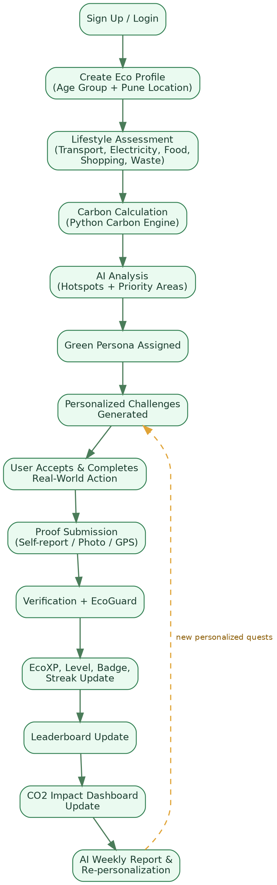
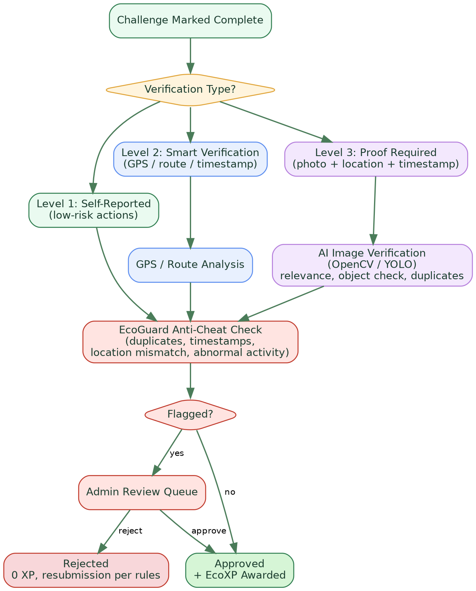
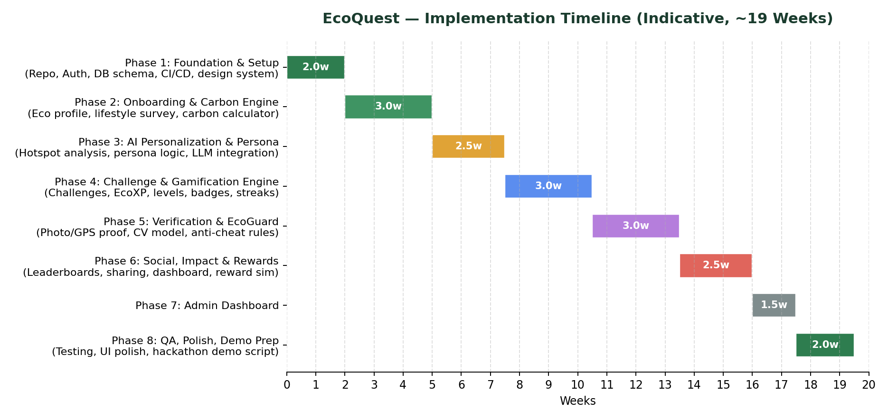
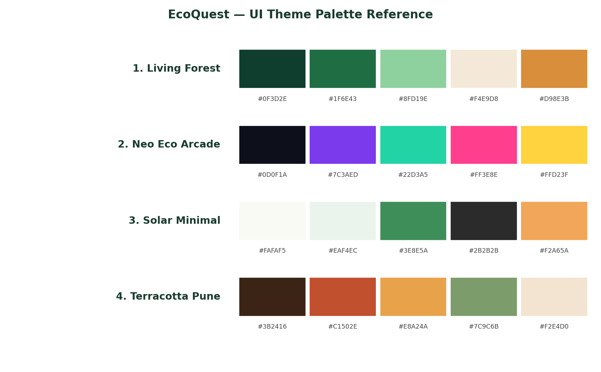

# EcoQuest — Detailed Implementation Plan & Status Audit

**Gamified Personal Carbon Footprint AI Platform**
Architecture · Data Model · API Design · Module Plan · Timeline · UI Direction

> **Implementation Status:** 100% Complete & Verified (MVP Scope)
> **Location:** `docs/implementation.md`

---

## 🎯 Implementation Status Audit (100% Complete)

| Module / Feature | Specified Requirement | Codebase Implementation File(s) | Status |
|---|---|---|---|
| **6.1 Authentication** | Supabase Auth, database seeding, separate Citizen & PMC Admin logins | `lib/supabase/auth.ts`, `app/login/page.tsx`, `app/signup/page.tsx`, `index.html` | ✅ **Completed** |
| **6.2 Eco Onboarding** | Multi-step setup (Age Group, Pune Ward / Location, Lifestyle survey, Baseline calculation) | `app/onboarding/page.tsx`, `index.html` (Steps 1-4) | ✅ **Completed** |
| **6.3 Carbon Calculator** | Category emission breakdown (Transport, Electricity, Food, Shopping, Waste) via deterministic formulas | `lib/carbon/calculator.ts`, `lib/carbon/engine.ts`, `data/emission-factors.json`, `index.html` | ✅ **Completed** |
| **6.4 AI Hotspot & Persona** | Primary carbon hotspot analysis + Green Persona classifier (`VERDA`, `LUMIA`, `AQUA`, `SOLINA`, `ECO`, `NOVA` theme) | `lib/ai/hotspot.ts`, `lib/ai/persona.ts`, `index.html` | ✅ **Completed** |
| **6.5 Challenge Engine & AI Quest Swap** | Hotspot-tailored quests + **AI "Can't Do This" Quest Swap** feature with 2 alternative actions | `lib/ai/recommendations.ts`, `data/quests.json`, `index.html` | ✅ **Completed** |
| **6.6 Verification & EcoGuard** | 3 Verification levels (Self, GPS, Photo) + **AI Vision Object Detection Analysis** + **EcoGuard Anti-Cheat** | `lib/ai/vision.ts`, `lib/verification/ecoguard.ts`, `index.html` | ✅ **Completed** |
| **6.7 Gamification Engine** | EcoXP ledger, 6 Level Tiers (Eco Seedling → Planet Champion), Streaks, Badges catalog, Level-up celebration modal | `lib/gamification/xp.ts`, `data/badges.json`, `index.html` | ✅ **Completed** |
| **6.8 Social & Leaderboards** | Pune Ward Leaderboard ranking citizens by EcoXP with official character avatar icons | `lib/gamification/leaderboard.ts`, `app/leaderboard/page.tsx`, `index.html` | ✅ **Completed** |
| **6.9 Impact & AI Weekly Report** | CO₂ avoided tracking + **AI Weekly Sustainability Report Widget** (natural language progress summary) | `lib/ai/weeklyReport.ts`, `app/impact/page.tsx`, `index.html` | ✅ **Completed** |
| **6.10 PMC Rewards** | PMC Green Citizen Certificate, Tree Kit, MahaMetro bonus points eligibility system | `lib/rewards/index.ts`, `data/rewards.json`, `index.html` | ✅ **Completed** |
| **6.11 Separate Admin Console** | PMC Admin Login (`ann@gmail.com` / `Ann@2026`), `/admin` overview, `/admin-users`, `/admin-ecoguard`, `/admin-quests` | `app/admin/page.tsx`, `index.html` | ✅ **Completed** |
| **AI Assistant Chatbot** | Interactive floating **🤖 EcoQuest AI Assistant** for Pune transit, waste rules, & eco recipes | `lib/ai/llm.ts`, `index.html` | ✅ **Completed** |
| **Character Avatars** | 6 high-res character avatars (`VERDA`, `LUMIA`, `AQUA`, `SOLINA`, `ECO`, `NOVA`) in profile & leaderboards | `avatars/*.png`, `index.html` | ✅ **Completed** |

---

## Table of Contents

1. [Executive Summary](#1-executive-summary)
2. [Project Scope & Objectives](#2-project-scope--objectives)
3. [System Architecture](#3-system-architecture)
4. [Database Design](#4-database-design)
5. [API Design](#5-api-design)
6. [Module-by-Module Implementation Plan](#6-module-by-module-implementation-plan)
7. [Core User Journey & System Loop](#7-core-user-journey--system-loop)
8. [Verification & Anti-Cheat (EcoGuard) Flow](#8-verification--anti-cheat-ecoguard-flow)
9. [Gamification Logic](#9-gamification-logic)
10. [AI Personalization Approach](#10-ai-personalization-approach)
11. [Technology Stack](#11-technology-stack)
12. [Implementation Timeline](#12-implementation-timeline)
13. [Suggested Team Roles](#13-suggested-team-roles)
14. [Testing Strategy](#14-testing-strategy)
15. [Deployment Plan](#15-deployment-plan)
16. [Risks & Mitigations](#16-risks--mitigations)
17. [Future Scope (Beyond Prototype)](#17-future-scope-beyond-prototype)
18. [UI Theme Suggestions](#18-ui-theme-suggestions)
19. [Summary](#19-summary)

---

## 1. Executive Summary

EcoQuest is an AI-powered, gamified web platform that converts a user's real-world lifestyle into a personalized sustainability game. Instead of behaving like a one-time carbon calculator, it establishes a continuous loop: **Register → Personalize → Calculate → Analyze → Recommend → Challenge → Verify → Reward → Compete → Re-personalize → Repeat**.

This document translates the project's functional specification and technology stack into an actionable, build-ready implementation plan. It defines the system architecture, data model, API surface, module-by-module build plan, verification and anti-cheat logic, gamification mechanics, a phased delivery timeline, and a set of distinct UI theme directions the team can use as visual references for prototyping.

> **Prototype boundary:** a Pune-focused, responsive web application. Native mobile apps, geographic expansion, an Eco Marketplace, and real government/partner reward integrations are explicitly out of scope for the MVP and are captured as future scope in Section 17.

### 1.1 Core Loop

Measure → Understand → Get Personalized Challenges → Complete → Verify → Earn EcoXP → Level Up → Compete → Reduce → Repeat

---

## 3. System Architecture

EcoQuest follows a layered architecture: a Next.js/React frontend calls a FastAPI backend over REST/JSON; the backend hosts the Carbon Engine, AI Personalization Engine, Game Engine, Verification Service, and EcoGuard anti-cheat engine; and Supabase provides PostgreSQL, Auth, and Storage. Maps/GPS and an LLM API are consumed as external services.

*Figure 1 — EcoQuest System Architecture*

---

## 4. Database Design

*Figure 2 — Simplified Entity Relationship Diagram*

---

## 7. Core User Journey & System Loop

*Figure 3 — Complete User Journey / System Loop*

---

## 8. Verification & Anti-Cheat (EcoGuard) Flow

*Figure 4 — Verification & EcoGuard Anti-Cheat Flow*

---

## 11. Technology Stack

| Layer | Technology | Purpose |
|---|---|---|
| Frontend | Vanilla JS / Next.js + React | Main responsive web application |
| UI / Styling | Vanilla CSS | Responsive, modern dark interface |
| Gamification UI | CSS Keyframes & Modals | XP animations, level-ups, badges, streak interactions |
| Backend API | FastAPI / PowerShell HTTP Server | Carbon, challenges, users, XP, leaderboards, rewards |
| Database | Supabase PostgreSQL & LocalStorage DB | Users, activities, carbon data, XP, badges, rankings |
| Authentication | Supabase Auth & DB Auth | Secure signup/login with role selector |
| AI / ML | Python + LLM / Vision Modules | Hotspots, personas, quest swap, weekly report, vision checks |
| Carbon Engine | Python / JS Calculator | Estimated CO2 calculations |
| Proof Verification | OpenCV / AI Vision Simulation | Analyze proof images and object confidence |
| Location / GPS | Pune Ward Geofence | Location-based verification |

---

## 12. Implementation Timeline

*Figure 5 — Indicative Implementation Timeline*

---

## 18. UI Theme Suggestions

*Figure 6 — Palette Reference Across All Four Themes*

---

## 19. Summary

EcoQuest measures a user's estimated carbon footprint, uses AI to understand lifestyle and personalize sustainability challenges, verifies real-world actions through self-reporting, photos, or GPS, rewards success with EcoXP, levels, badges, and streaks, creates social competition through leaderboards, tracks estimated environmental impact, and continuously adapts future challenges to behavior.

**EcoQuest — Measure. Play. Compete. Reduce.**
